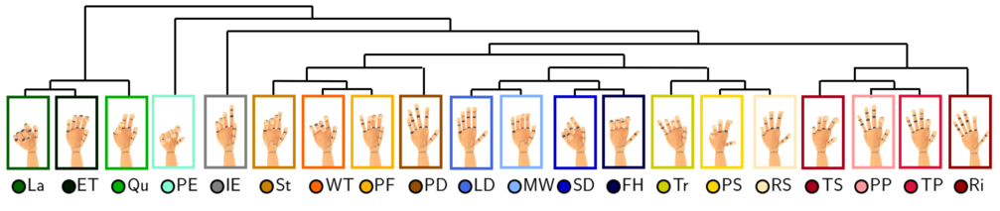
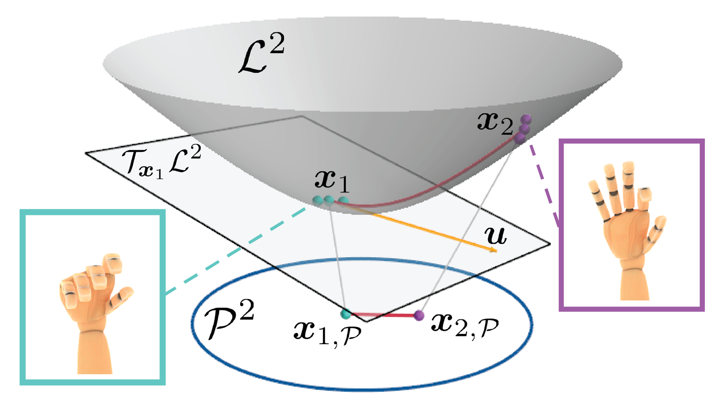

# Gaussian process hyperbolic latent variable models

This repository contains pytorch implementations of Gaussian process hyperbolic latent variable models (GPHLVM) and 
the source code for reproducing the grasping taxonomy results of the two following papers: 

- Noémie Jaquier, Leonel Rozo, Miguel Gonzalez-Duque, Viacheslav Borovitskiy, and Tamim Asfour, "[**Bringing Motion Taxonomies to Continuous Domains via GPLVM on Hyperbolic Manifolds**](https://openreview.net/pdf?id=ndVXXmxSC5)", ICML 2024. 
- Luis Augenstein, Noémie Jaquier, Tamim Asfour, and Leonel Rozo, "[**On Probabilistic Pullback Metrics for Latent Hyperbolic Manifolds**](https://arxiv.org/pdf/2410.20850)", arXiv preprint, 2024.

 
 

# Installation Guide
To install this repository, first clone the repository and install the related packages, as explained below.

```
git clone git@github.com:NoemieJaquier/hyperbolic-gplvms.git
cd hyperbolic-gplvms
pip install -r requirements.txt
```

# GPHLVMs examples
The following basic examples are located in the folder "examples/gphlvms":

1. GPHLVM trained via MAP estimation (*gphlvm_map.py*)
2. Bayesian GPHLVM trained via variational inference (*gphlvm_variational.py*)


# Running grasping taxonomy experiments
Trained models reproducing the results of [**Bringing Motion Taxonomies to Continuous Domains via GPLVM on Hyperbolic Manifolds**](https://openreview.net/pdf?id=ndVXXmxSC5) are located in the folder "grasp_saved_models_gplvm". The results can be visualized by running:

1. GPHLVM with 2-d hyperbolic latent space
    ```
    python3 gphlvm_grasp_taxonomy.py --model_type="MAP" --latent_dim=2 --loss_type="Stress" --loss_scale=5500.0 --load_on=True

    python3 gphlvm_grasp_taxonomy.py --model_type="BC" --latent_dim=2 --loss_type="Stress" --loss_scale=2000.0 --load_on=True
    ```
2. GPLVM with 2-d Euclidean latent space
    ```
    python3 gplvm_grasp_taxonomy.py --model_type="MAP" --latent_dim=2 --loss_type="Stress" --loss_scale=5500.0 --load_on=True

    python3 gplvm_grasp_taxonomy.py --model_type="BC" --latent_dim=2 --loss_type="Stress" --loss_scale=2000.0 --load_on=True
    ```
3. GPHLVM with 3-d hyperbolic latent space
    ```
    python3 gphlvm_grasp_taxonomy.py --model_type="MAP" --latent_dim=3 --loss_type="Stress" --loss_scale=6000.0 --load_on=True

    python3 gphlvm_grasp_taxonomy.py --model_type="BC" --latent_dim=3 --loss_type="Stress" --loss_scale=3000.0 --load_on=True
    ```
4. GPLVM with 3-d Euclidean latent space
    ```
    python3 gplvm_grasp_taxonomy.py --model_type="MAP" --latent_dim=3 --loss_type="Stress" --loss_scale=6000.0 --load_on=True

    python3 gplvm_grasp_taxonomy.py --model_type="BC" --latent_dim=3 --loss_type="Stress" --loss_scale=3000.0 --load_on=True
    ```
   
New GPHLVMs and GPLVMs can be trained by running:
```
python3 gphlvm_grasp_taxonomy.py --model_type="MAP" --latent_dim=latent_dim --loss_type="Stress" --loss_scale=loss_scale --load_on=False
python3 gphlvm_grasp_taxonomy.py --model_type="BC" --latent_dim=latent_dim --loss_type="Stress" --loss_scale=loss_scale --load_on=False
python3 gplvm_grasp_taxonomy.py --model_type="MAP" --latent_dim=latent_dim --loss_type="Stress" --loss_scale=loss_scale --load_on=False
python3 gplvm_grasp_taxonomy.py --model_type="BC" --latent_dim=latent_dim --loss_type="Stress" --loss_scale=loss_scale --load_on=False
```

(replace "latent_dim" and "loss_scale" by the desired values). The models will be saved in the folder "grasp_saved_models_gplvm".

# Training a GPHLVM on MNIST and computing pullback metrics
Trained models reproducing the results of [**On Probabilistic Pullback Metrics for Latent Hyperbolic Manifolds**](https://arxiv.org/pdf/2410.20850) are located in the folder "mnist_saved_models_gplvm". The results can be visualized by running:

1. GPHLVM with 2-d hyperbolic latent space
    ```
    python3 gphlvm_mnist.py --model_type="MAP" --latent_dim=2 --load_on=True
    ```
2. GPLVM with 2-d Euclidean latent space
    ```
    python3 gplvm_mnist.py --model_type="MAP" --latent_dim=2 --load_on=True
    ```

New GPHLVMs and GPLVMs can be trained by running:
```
python3 gphlvm_mnist.py --model_type="MAP" --latent_dim=2 --load_on=False --plot_on=True

python3 gplvm_mnist.py --model_type="MAP" --latent_dim=2 --load_on=False --plot_on=True
```
The models will be saved in the folder "mnist_saved_models_gplvm".

# References
If this code was useful for your research, please consider citing our work :-) 
```
@InProceedings{Jaquier24:GPHLVM,
	Title       = {Bringing motion taxonomies to continuous domains via GPLVM on hyperbolic manifolds},
	Author      = {Jaquier, No\'emie and Rozo, Leonel and Gonz\'alez-Duque, Miguel and Borovitskiy, Viacheslav and Asfour, Tamim},
	Booktitle   = {International Conference on Machine Learning (ICML)},
	Year        = {2024},
	Pages      = {},
}
```
```
@InProceedings{Augenstein25:Hyperbolic,
	Title       = {On Probabilistic Pullback Metrics on Latent Hyperbolic Manifolds},
	Author      = {Augenstein, Luis and Jaquier, No\'emie and Asfour, Tamim and Rozo, Leonel},
	Booktitle   = {arXiv preprint arXiv 2410.20850},
	Year        = {2024},
    pages       = {},
    URL         = {https://arxiv.org/abs/2410.20850},
}
```